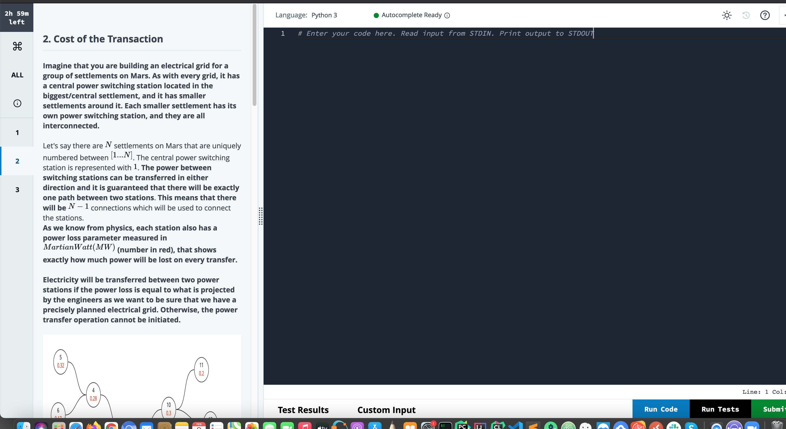

# Cost of transaction 

Imagine that you are building an electircal grid for a group of settlements on mars. As with every grid for a group of settlements on Mars. as with every grid, it has a central power switching station located in the bigges/central settlement, and is has smaller settlements arround it. Each smeller settlement has its own power switching station, and they are all intercoonected.




To execute, run on terminal:

```py
python3 -m unittest
```


